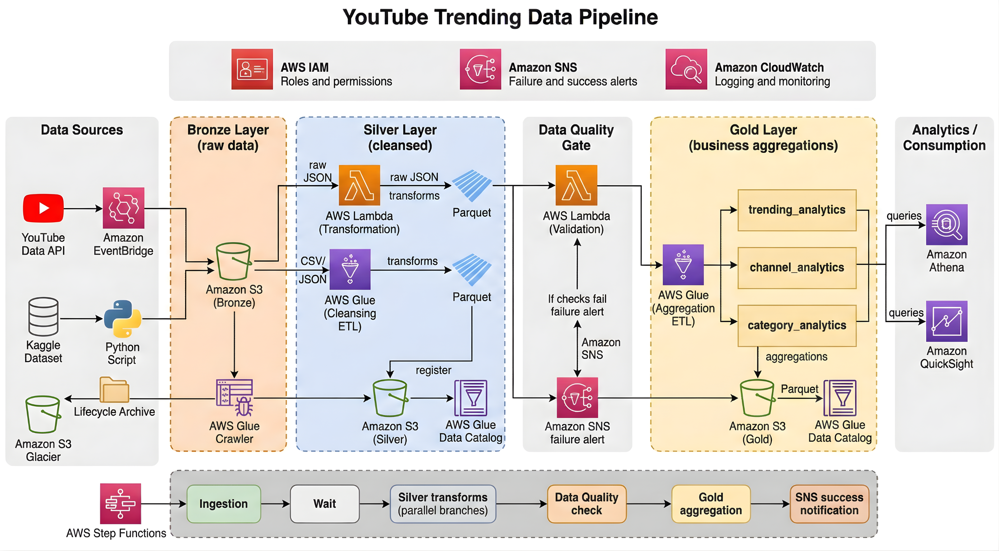

# yt-data-pipeline

This is a pet-project utilizing AWS

## Project Goals

## List of services used

- Amazon Athena
- Amazon CloudWatch
- Amazon S3 (Buckets, Lifecycle rules)
- Amazon SNS
- AWS Lambda
- AWS Glue (Databases, Crawlers, ETL jobs)
- AWS Glue Data Catalog
- AWS IAM (Users, Roles)

## Project Architecture

